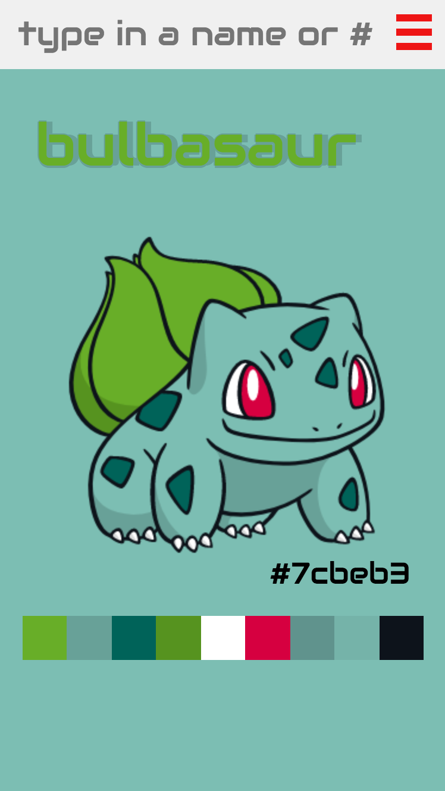
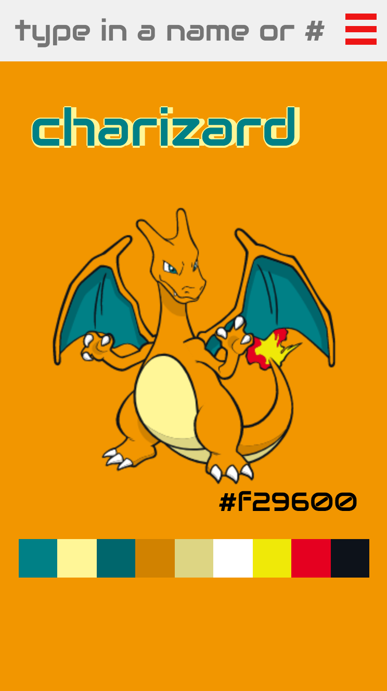

# Cartoon Palettes

[Live Site](https://iamsammak.github.io/cartoonpalettes/)

CartoonPalettes is visualize representation of everyday cartoons viewed from the eyes of a designer. Each cartoon character is displayed with its 10 most prominent colours. The dominant colour becomes the background wher 9 are displayed in a palette strip.
Currently the site only supports the original 151 Pokemon but more in the works.

## Mobile view (screenshots: iPhone 6)

 

## Desktop view


## Origin

Currently, building an app to pull color data from images and stumbled across Canvas' getImageData method. So I decided to build this on the side to play around with that data.

### Data Grab Steps

1. Pulled image Data with ```getImageData```
```js
  let imageData = ctx.getImageData(canvas.width, canvas.height,
    img.width, img.height).data;
```
2. Parsed through the data and converted RGB strings into Hexcodes
```js
  const imgDataToHexCode = function(color) {
    let r = color.red.toString(16);
    let g = color.green.toString(16);
    let b = color.blue.toString(16);
    // prepend '0' before 0-9 digits
    if (r.length === 1) {
      r = '0' + r;
    }
    if (g.length === 1) {
      g = '0' + g;
    }
    if (b.length === 1) {
      b = '0' + b;
    }

    return '#' + r + g + b;
  };
```

3. Counted the occurrence of each color and saved top 10 colours into a JSON object to save on future lookup time.
```js
loadData() {
  let that = this;
  $.getJSON('./js/pokemon_data2.json', function(data) {
    that.pokemonData = data;
    that.loadPokemon();
  });
}
```

4. A simple python http server was used to host and pull data
Run follow code in command line:
```bash
$ python -m SimpleHTTPServer
```

## Export Palette
Users can easily grab the colour palette from the export modal
Palette Colours are formatted in: Hex, RGB, HTML and CSS


### Current in the works: Future Features
  - Add different cartoon worlds
      + Fire Emblem Heroes Characters are in the works
  - Double pane view
    + Allow user to put compare two characters side by side (desktop view only)
  - Palette View Options
  - Download/Copy Palette Option
    + Export Current Palette Modal
    + clipboard.js
  - Download as wallpaper
